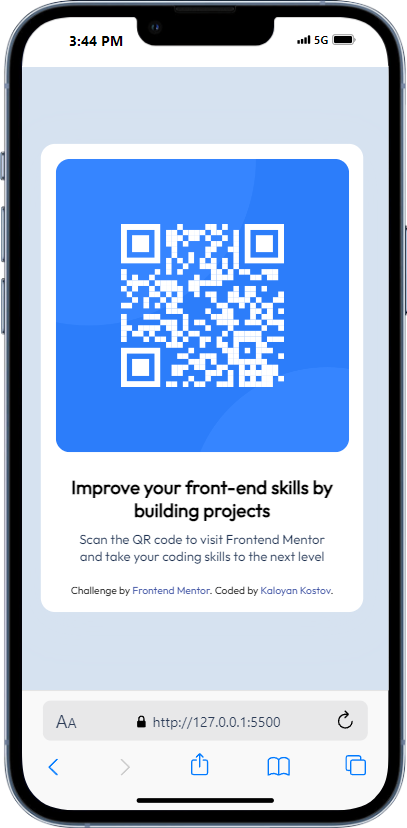

# Frontend Mentor - QR code component solution

This is a solution to the [QR code component challenge on Frontend Mentor](https://www.frontendmentor.io/challenges/qr-code-component-iux_sIO_H). Frontend Mentor challenges help you improve your coding skills by building realistic projects.

## Table of contents

- [Frontend Mentor - QR code component solution](#frontend-mentor---qr-code-component-solution)
  - [Table of contents](#table-of-contents)
  - [Overview](#overview)
    - [Screenshot](#screenshot)
    - [Links](#links)
  - [My process](#my-process)
    - [Built with](#built-with)
  - [Author](#author)

## Overview

### Screenshot

### Links

- Solution URL: [https://github.com/Kaloyan-Kostov/Frontend-Mentor/tree/main/Newbie/qr-code-component-main](https://github.com/Kaloyan-Kostov/Frontend-Mentor/tree/main/Newbie/qr-code-component-main)

## My process

Completed via using HTML and style tag element.

### Built with

- Semantic HTML5 markup

## Author

- GitHub - [Kaloyan-Kostov](https://github.com/Kaloyan-Kostov)
- Frontend Mentor - [@Kaloyan-Kostov](https://www.frontendmentor.io/profile/Kaloyan-Kostov)
